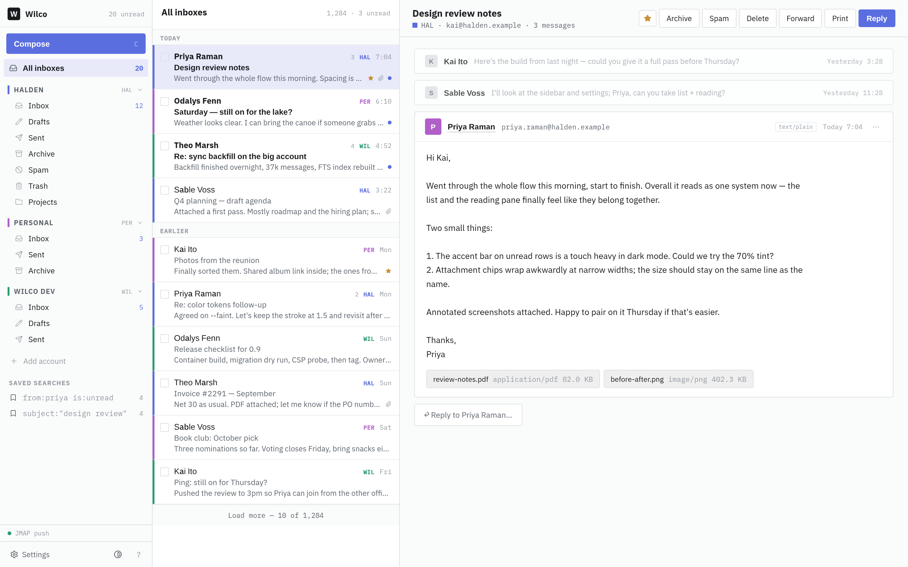

# Wilco

A self-hosted, single-user email client over JMAP: one unified inbox across
several accounts, full-text search, HTML compose, sandboxed message
rendering. Node server with zero runtime dependencies, SQLite + FTS5,
Preact client. Tested against Fastmail.

- **Install:** [INSTALL.md](INSTALL.md) — one container plus a TLS proxy with two hostnames.
- **Develop:** [CONTRIBUTING.md](CONTRIBUTING.md).
- **Design:** [docs/design/](docs/design/) — the visual design and its reference renders.

## How it works

The server holds every JMAP token (sealed with a master key) and syncs each
account into a local SQLite cache; the browser never sees a token and talks
only to Wilco's own JSON API, with new mail pushed over server-sent events.
Message HTML never enters the app's page: it is sanitized server-side and
served from a second hostname under a short-lived capability token, into a
sandboxed iframe with a strict CSP, so a sender's markup is isolated from the
app by origin.
